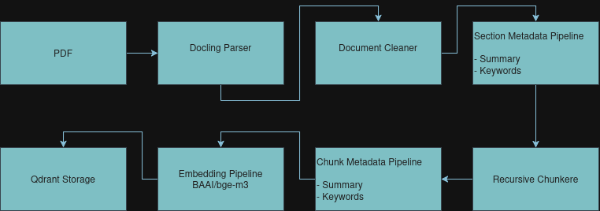

# ATLANTASANAD AI Assistant

Production-ready Retrieval-Augmented Generation (RAG) system for ATLANTASANAD Assurance.

---

# Objective

This project aims to build an enterprise AI assistant capable of answering questions from internal company documentation while ensuring:

- 100% local execution (no cloud services)
- Protection of sensitive company data
- Production-ready architecture
- Modular and extensible pipeline

The ingestion pipeline transforms raw PDF documents into searchable vectors stored inside Qdrant.

---

# Current Architecture



---

# Current Pipeline

## 1. Parsing

Responsible for extracting document structure.

Input

```
PDF
```

Output

```
Document
 ├── metadata
 ├── sections
 └── content blocks
```

Current implementation

- Docling parser

---

## 2. Cleaning

Removes useless information while preserving document structure.

Examples

- Empty blocks
- Duplicate spaces
- Invalid content
- Formatting artifacts

Output

```
Clean Document
```

---

## 3. Section Semantic Metadata

Each section is summarized by the local LLM.

Generated metadata

- Summary
- Keywords
- Generation information

Example

```
Section

Title:
Assistance

↓

Summary:
Describes roadside assistance services...

Keywords:
assistance
breakdown
towing
vehicle
```

Purpose

Improve retrieval quality without embedding unnecessary duplicated context.

---

## 4. Chunking

Each section is divided into smaller chunks using recursive splitting.

Configuration

- Recursive splitter
- Configurable chunk size
- Configurable overlap

Each chunk stores

- chunk id
- chunk index
- parent section

---

## 5. Chunk Semantic Metadata

Each chunk receives semantic metadata generated by the LLM.

Generated

- Summary
- Keywords

Purpose

Improve semantic retrieval and future reranking.

---

## 6. Embedding

Each chunk is converted into a dense vector.

Current model

```
BAAI/bge-m3
```

Generated metadata

- embedding provider
- embedding model
- indexing date
- chunk hash
- chunking strategy

---

## 7. Storage

Vectors are stored inside Qdrant.

Each point contains

```
Vector

Payload

- document id
- file name
- chunk id
- chunk index
- section title
- section summary
- keywords
- chunk summary
- chunk keywords
- original text
```

---

# Local AI

No cloud APIs are used.

Current LLM

```
Ollama
```

Current model

```
qwen2.5:3b
```

Everything runs locally.

---

# Project Structure

```
src/

    ingestion/

        parsing/
        cleaning/
        metadata/
        chunking/
        embedding/
        storage/
        pipeline/

    llm/

    embeddings/

    config/

    models/
```

---

# Current Progress

Completed

- PDF parsing
- Document model
- Cleaning pipeline
- Section metadata generation
- Recursive chunking
- Chunk metadata generation
- Embedding generation
- Qdrant integration
- Complete ingestion pipeline

---

# Next Steps

- Retrieval pipeline
- Hybrid Search
- Metadata filtering
- Query rewriting
- Reranking
- Context builder
- Prompt builder
- Answer generation
- API integration
- Agent orchestration
- Evaluation framework

---

# Design Principles

- Modular architecture
- SOLID principles
- Local-first execution
- Enterprise-ready
- Extensible pipelines
- Strong typing
- Reusable components
- Configuration-driven design

---

# Technologies

| Component | Technology |
|------------|------------|
| Parsing | Docling |
| LLM | Ollama |
| Model | Qwen2.5 |
| Embedding | BAAI/bge-m3 |
| Vector Database | Qdrant |
| Language | Python 3.11 |

---

# Status

Current milestone:

✅ Ingestion Pipeline Completed

Next milestone:

➡ Retrieval Pipeline